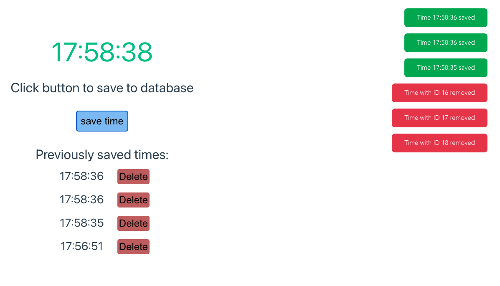
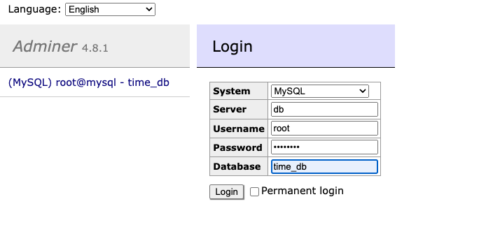
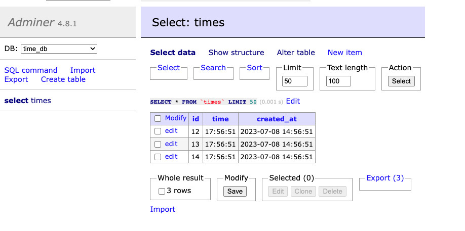

# Time Application
Time application consists of the frontend and backend parts
Frontend is written with help of the Vue.js framework
Backend is written using Node.js and Express
Database is MySQL

### App

### Adminer

### Run application
> docker-compose up --build